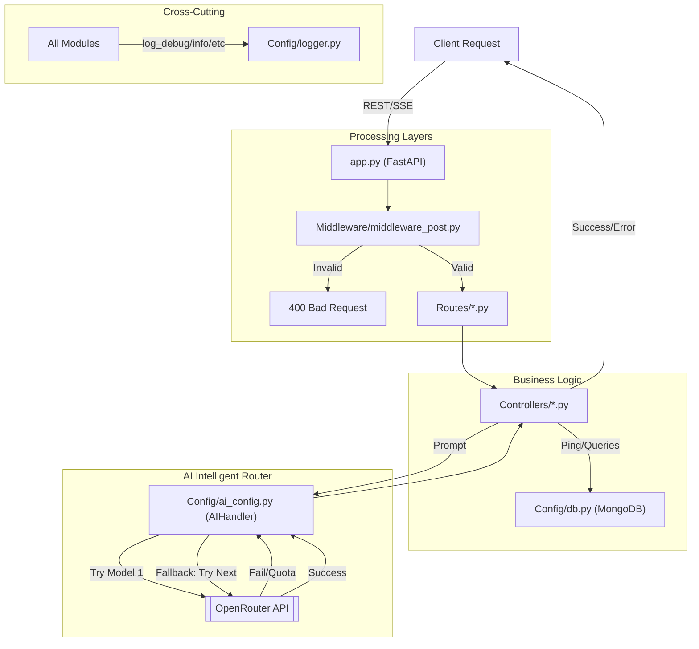

# ThinkBack Backend Architecture 🚀

This directory contains the FastAPI-powered "intelligence layer" for the ThinkBack platform. It manages data persistence, robust AI reasoning, and real-time educational streaming.

## 🔄 Core Request Flow



## 📂 Detailed Component Map

### 1. `Routes/` & `Controllers/`
- **Tickets**: Handled by `post_routes.py` and `post_controller.py`. Manages post creation and retrieval.
- **Chat (SSE)**: Handled by `chat_routes.py` and `chat_controller.py`. Uses Server-Sent Events to stream AI tutor responses.

### 2. `Config/`
- **`ai_config.py`**: The "Safety Net" router. Handles multi-model fallbacks, retries, and OpenAI SDK integration for OpenRouter.
- **`limiter.py`**: Centralized rate-limiting using `slowapi`.
- **`db.py`**: Database connection pooling for MongoDB Atlas.
- **`logger.py`**: Custom emoji-pattern logging (`ℹ️`, `✅`, `⚠️`, `❌`).

### 3. `Middleware/` & `Schema/`
- **Validation**: `middleware_post.py` enforces data integrity (title length, category choice).
- **Contracts**: `post_model.py` defines Pydantic schemas for request/response sync.

---

## 🔑 Environment Variables (.env)

| Variable | Description |
|---|---|
| `DEVELOPMENT` | Set to `TRUE` for verbose emoji-pattern logging |
| `OPENROUTER_API_KEY` | Your OpenRouter API Key |
| `AI_MODEL_LIST` | Comma-separated prioritized list (e.g., `deepseek/deepseek-r1,openai/gpt-4o`) |
| `AI_RETRIES` | Max retries per model before moving to fallback (default: 2) |
| `MONGODB_URI` | MongoDB Atlas connection string |

## 🛡️ Rate Limiting (slowapi)
To prevent abuse, the following limits are applied:
- **Streaming Chat**: 10 requests / minute
- **Ticket Creation**: 10 requests / minute

## 💡 Technical Choices & Rationale

| Choice | Why? |
|---|---|
| **Motor (Async MongoDB)** | FastAPI is an asynchronous framework. Using `motor` ensures that database I/O is non-blocking, allowing the server to handle concurrent AI streams without performance bottlenecks. |
| **CORS Middleware** | Essential for allowing our Frontend (React/Next.js) to securely make requests to the API when hosted on different ports or domains. |
| **Rate Limiting (10/min)** | Prevents "API Exhaustion". Since LLM tokens are expensive/limited, we restrict usage to ensure the service remains available for everyone. |
| **Multi-Model Fallback** | AI models can sometimes fail or hit quotas. Our `AIHandler` automatically fails over to cheaper/alternative models to maintain 100% uptime. |

## 🚀 Getting Started
Run the development server with hot-reloading:
```bash
fastapi dev app.py
```
This enables debug logs and auto-updates the API as you code.
