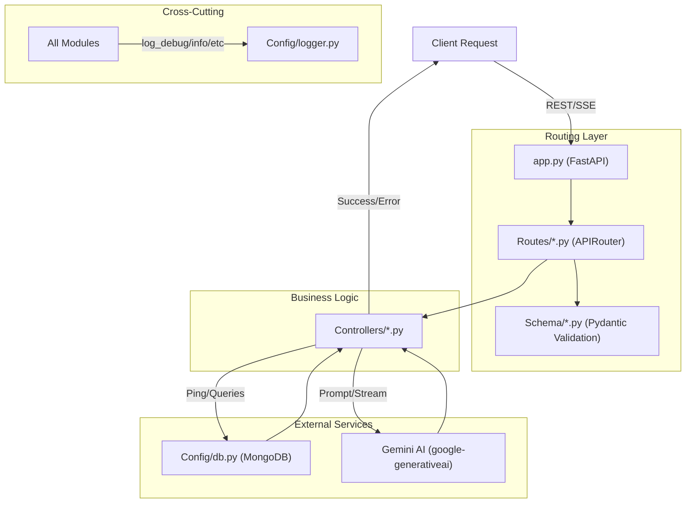

# ThinkBack Backend Architecture

This directory contains the FastAPI-powered backend for the ThinkBack platform.

## 🔄 Core Request Flow



## 📂 Directory Breakdown

- **`app.py`**: Entry point. Initializes FastAPI, sets up Lifespan (DB connect/disconnect), and includes routers.
- **`Routes/`**: Contains endpoint definitions and URL path prefixing.
- **`Controllers/`**: Contains the core logic for processing requests, handling AI interactions, and database operations.
- **`Config/`**:
  - `db.py`: MongoDB connection management.
  - `logger.py`: Custom emoji-pattern logging system.
- **`Schema/`**: Pydantic models for request/response validation and serialization.

## 🔑 Environment Variables (.env)

| Variable | Description |
|---|---|
| `PORT` | Port number for the FastAPI server (default: 8000) |
| `DEVELOPMENT` | Set to `TRUE` for verbose emoji-pattern logging |
| `MONGODB_URI` | Connection string for MongoDB Atlas |
| `GEMINI_API_KEY` | API Key for Google Gemini AI |

## 📡 API Endpoints

### Ticket Management
- `GET /api/tickets/` - Fetch all educational tickets
- `POST /api/tickets/` - Create a new ticket (triggers AI summary)

### AI Chat (Streaming)
- `POST /api/chat/global/stream` - Global educational AI tutor stream
- `POST /api/chat/ticket/{ticket_id}/stream` - Context-aware AI chat based on a specific ticket

## 🚀 Execution
Run the development server from this directory:
```bash
fastapi dev app.py
```
