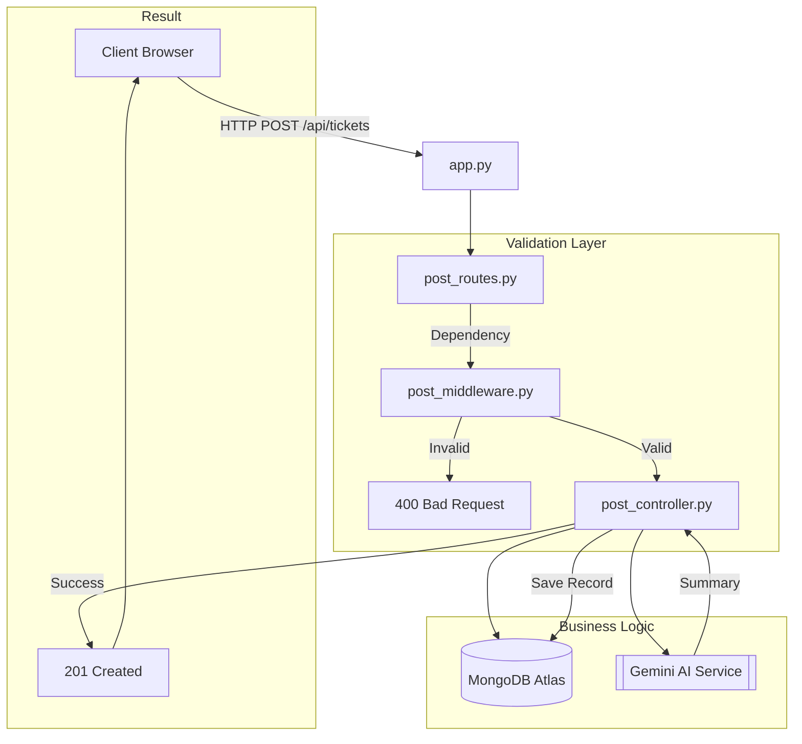

# ThinkBack Backend Deep-Dive 🚀

This directory contains the core intelligence and data management layer for the ThinkBack platform.

## 🔄 Lifecycle of a Request



## 📂 Component Map

### 1. `Routes/`
Directs incoming requests to the appropriate controller. 
- **Post Routes**: Ticket creation and listing.
- **Chat Routes**: SSE streaming for AI conversations.

### 2. `Controllers/`
The "brain" of the backend.
- Manages the orchestration between the Database and the AI models.
- Handles error boundaries for external service failures.

### 3. `Middleware/` (New!)
Ensures data integrity before processing.
- **`post_middleware.py`**: Validates ticket length, category relevance, and required fields.

### 4. `Config/`
- **`db.py`**: Singleton-style database connection pooling.
- **`logger.py`**: Centralized, conditional logging using the `------------->emoji` pattern.

### 5. `Schema/`
Pydantic-powered data contracts (Models). Ensures Frontend and Backend stay in sync.

---

## 🛠 Setup & Debugging

### Environment Variables
Ensure your `.env` contains:
- `DEVELOPMENT=TRUE` to see the flow in your terminal.
- `GEMINI_API_KEY` for AI functionalities.

### Running with Dev Server
```bash
fastapi dev app.py
```
This enables hot-reloading and debug-level logs.
