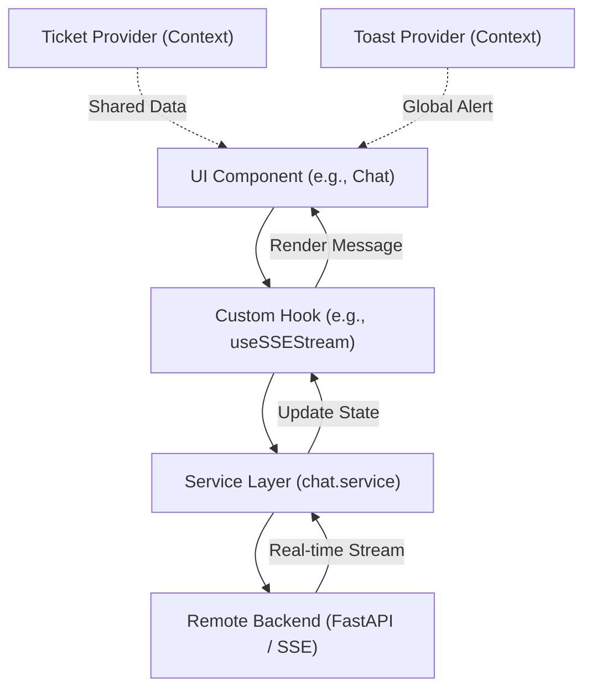

# ThinkBack Frontend

AI-powered educational helpdesk platform built with **React 19**, **Tailwind CSS v4**, and a high-performance **SSE Streaming** architecture.

## 🚀 Frontend URL: [think-back.vercel.app](https://think-back.vercel.app)

## ✨ Features

- **Global Ticket State**: Instant navigation with zero redundant loading via React Context.
- **Real-time AI Chat**: Live streaming responses using Server-Sent Events (SSE).
- **Premium UI**: Monochromatic, glassmorphic design with custom animations and loaders.
- **Toast Notifications**: Integrated global feedback system for user actions.
- **Persistent Sessions**: Chat history and ticket data cached for a seamless experience.

## 🛠 Tech Stack

- **React 19** - Utilizing the latest Concurrent Mode features.
- **Vite** - Lightning-fast development and optimized production builds.
- **Tailwind CSS v4** - Cutting-edge utility-first styling.
- **React Router 7** - Modern client-side routing with state passing.
- **Markdown Rendering** - `react-markdown` + `remark-gfm` for professional AI responses.

## 🏗 Architecture & Project Structure

The project follows a modular, service-oriented architecture:

```
src/
├── Components/
│   ├── Common/          # Shared UI (Navbar, Footer, Toast, Loader)
│   ├── Pages/           # Main Views (Dashboard, Tickets, Chat, About)
│   └── Forms/           # Complex Form logic (Create Ticket)
├── Context/             # Global State (TicketContext, ToastContext)
├── Hooks/               # Custom Logic (useSSEStream, useTickets)
├── Services/            # API Integration (ticket.service, chat.service)
├── Types/               # Unified TypeScript Definitions
├── Styles/              # Component-specific and Global CSS
└── utils/               # Formatting and Logger utilities
```

## 🔄 Flow of Working (Frontend)

The diagram below illustrates the flow of data from a user action to the backend and back to the UI:



1. **User Interaction**: User triggers an action (e.g., sends a message).
2. **Hook Logic**: Custom hooks manage complex side effects and local state.
3. **Service Layer**: Centralized API calls handle the communication with the backend.
4. **Context Layer**: Global data (tickets, notifications) is persisted across the entire app.
5. **Real-time Update**: For chat, SSE streams chunks directly into the UI for a "thinking" effect.

## 🚀 Development

```bash
# Install dependencies
npm install

# Start development server
npm run dev

# Build for production
npm run build
```

## 📜 Project Principles

- ✅ **No Heavy Dependencies**: Custom loaders (`ScaleLoader`) and animations for speed.
- ✅ **Type Safety**: End-to-end TypeScript interfaces.
- ✅ **Responsive Design**: Mobile-first approach for all pages.
- ✅ **Clean Code**: Strict separation of styling, logic, and data.
